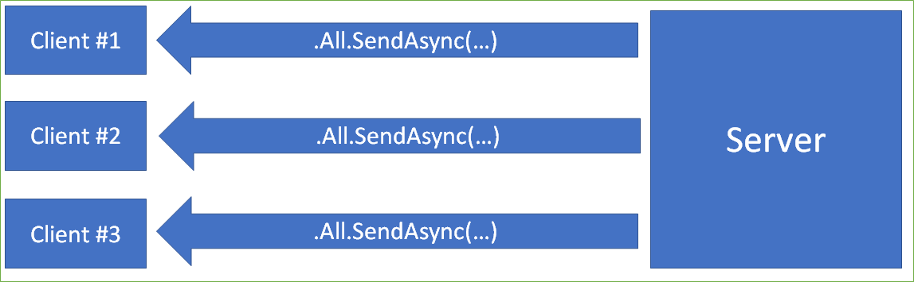

# Run ASP.NET Core SignalR at scale

SignalR apps present a number of unique challenges when scaling. SignalR clients have a very different impact on a web application than standard web clients because of the persistent nature of SignalR connections. When building high-scale apps using SignalR, it's important to consider these scaling challenges.

SignalR apps need to scale based on two different criteria: The number of messages exchanged, and the number of clients connected.

Scaling for the number of messages exchanged, is relatively straightforward. Scalability problems based on this criteria appear as high CPU load and high Memory consumption. Using more powerful hardware or increasing the number of servers can help resolve these issues. However, you need to configure a "backplane" (see below) to ensure each server can properly communicate with each other.

Scaling for the number of concurrent connections is more complicated. Scalability problems based on this criteria appear as dropped connections, even when the CPU and Memory load of the server is relatively low. Concurrent connections consume a number of different resources on the server such as TCP ports and thread-pool threads. Using more powerful hardware or more servers helps to resolve this issue, but produces a lot of waste, since you don't need additional CPU and Memory capacity.

## Azure SignalR Service

The simplest way to scale out a SignalR app is using the Azure SignalR Service. When using the Azure SignalR Service, clients connect directly to the Service, rather than to your application. The Service routes messages as needed to your app servers and forwards messages from your app to all the connected clients.

See the [Azure SignalR Service documentation](https://docs.microsoft.com/en-us/azure/azure-signalr/signalr-overview) for more information.

## Manual scale-out considerations

If you aren't able to use the Azure SignalR Service, there are some things to consider when scaling your SignalR app.

### Reducing the impact of persistent connections

A SignalR user has a very different impact on your application then a standard web user. When a web user is interacting with your application, they only consume resources when making requests to your app. However, a SignalR user consumes resources in your app even when idle. This is because SignalR connections are persistent, which means they must stay active at all times, in order to receive incoming notifications from the server.

The high impact of SignalR users on application resources can make it difficult to scale in high-traffic scenarios. If you have a single web app handling both standard web traffic and SignalR traffic, the SignalR traffic is likely to consume most of the resources, causing web traffic to suffer. As a result, we recommend separating your SignalR traffic to a separate application. This allows you to scale the SignalR traffic as needed, indepedently of your standard web traffic.

### Backplanes

Each SignalR connection is associated with a single server. When your app is deployed to a single server, messages are broadcast to all clients connected to that server:

If you only have a single server, this is sufficient. All your clients connect to that server and the message is received by all of them. However, when your app is deployed to multiple servers, this means that broadcasts are only sent to clients connected to the specific server that triggers the broadcast:

To fix this, SignalR supports configuring a "backplane". All the servers connect to the backplane and make sure that messages are distributed across this backplane so that all servers can transmit them to their clients.

#### Configuring Redis to act as a backplane

[TODO]